```{r setup, include=FALSE}
knitr::opts_chunk$set(echo = FALSE)
```


## Background

> - RAB Day-In presentation from Taylor Ey from Melbourne Institute.
>   - Explanation of key components of an AI agent harness.
> - Taylor said we could all implement the things he was talking about.
>   - I wanted to put that to the test.
>   - Make a quick, light, non-trivial example 
> - I will walk through my toy example
>   - All done on my personal / home computer. 
>   - Getting more familiar with AI assisted coding. 

## Preview

::: {.build}
> A basic AI coding agent with:
:::

> - Instructions
>    - project-specific guidance
> - MCP 
>   - access to external tools and information
> - Skills
>    -  repeatable instructions and workflows
> - Sub-agents 
>   - getting multiple agents to work independently
> - Hooks 
>   - triggering actions automatically when something happens

## Toy example – Advent of Code

::: {style="display: grid; grid-template-columns: 0.85fr 1.15fr; gap: 18px; align-items: start;"}

::: {}
> - **Annual Christmas-themed coding puzzles**
> - Small programming and problem-solving challenges, released as an Advent calendar
> - Puzzles can be solved in any programming language
> - A link to the [Advent of Code website](https://adventofcode.com/?utm_source=chatgpt.com)
:::

::: {}
<div style="display: grid; grid-template-columns: repeat(2, minmax(0, 1fr)); grid-template-rows: 135px 135px; gap: 10px; justify-items: center; align-items: center; margin-top: 12px;">
  <div class="build">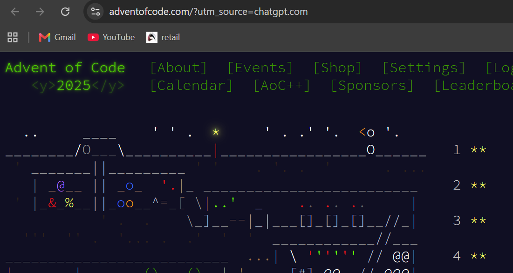</div>
  <div class="build">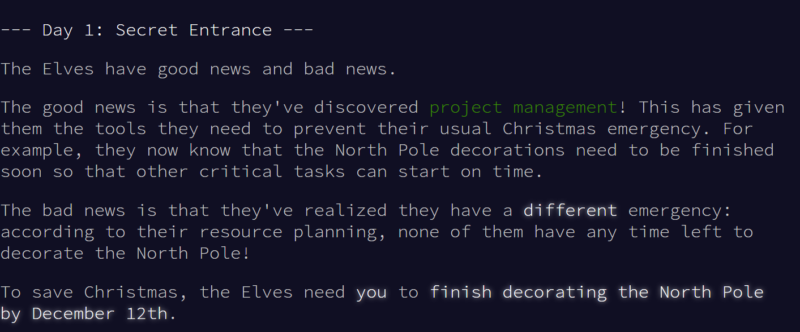</div>
  <div class="build">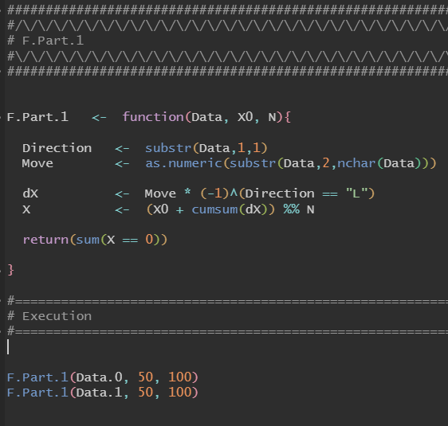</div>
  <div class="build">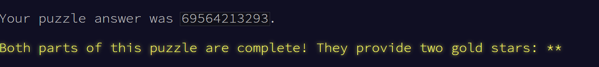</div>

</div>
:::
:::

## Advent of Code - 1 December 2025 

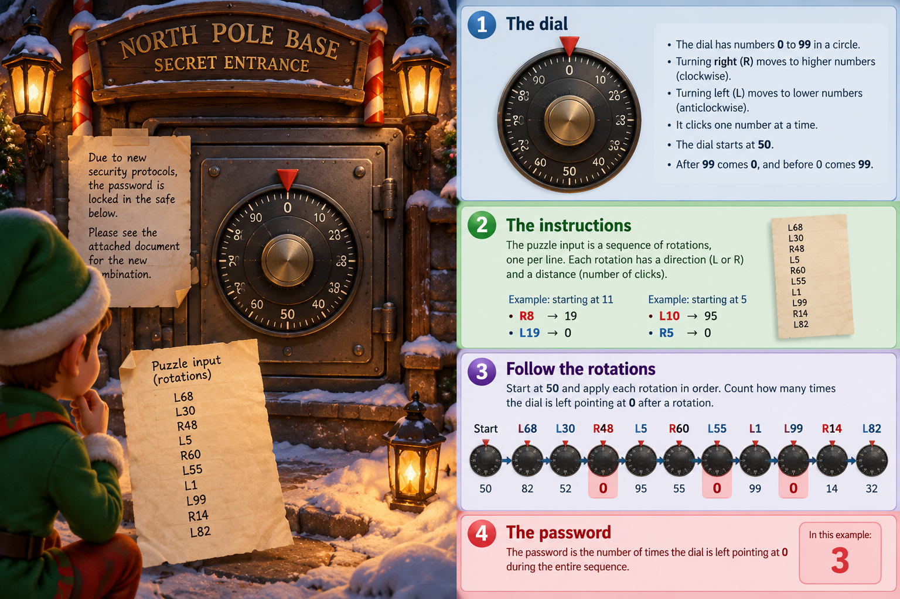

## Why Advent of Code a good test case:

> - **A repeated coding task**
>   - Lots of independent examples with consistent structure
>   - Each puzzle comes with its own instructions and input data
> - **A test of AI problem-solving and coding**
>   - Each puzzle is an independent challenge
>   - Easy to check whether the answer is correct
> - **I already have a well-structured benchmark**
>   - My own solutions provide a point of comparison
> - **It might actually be useful**
>   - Help me learn Python
>   - Help me discover better algorithms  

## What we are going to build

::: {.build}
> **An agent that will:**
:::

> - Take an **input of year and day**
> - Go to my **online Advent of Code repository**
>   - Obtain the puzzle instructions and input data
>   - Copy them to the local repository
> - **Solve the puzzle in R**
> - **Solve the puzzle independently in Python**
> - **Compare the two solutions conceptually**

## How we are going to build it

::: {.build}
> **We will give the agent:**
:::

> - **Project-specific instructions**
>   - Context, goals, coding guidance and project conventions
> - **MCP**
>   - Access to my online GitHub repositories
> - **Skills**
>   - Procedures for solving problems in R and Python
> - **Sub-agents**
>   - Run the R and Python skills independently and in parallel
> - **A hook**
>   - Automatically update a comparison document when a solution changes

## The environment

::: {.build}
> **Where the experiment lives:**
:::

> - **GitHub**
>   - Source code and repositories
> - **VS Code**
>   - Development environment
> - **GitHub Copilot**
>   - AI coding agent
> - **A local working repository**
>   - Where the experiment happens

## Visual Studio Code

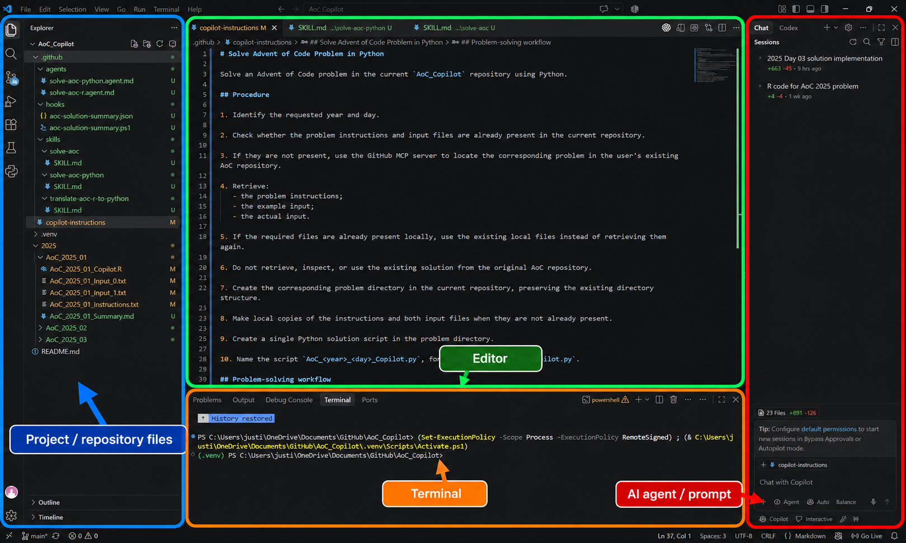

## GitHub — the source and the sandbox

::: {.build}
> **GitHub provides the files, tools and version control**
:::

> - **Advent of Code repository**
>   - Previous puzzles and my solutions
> - **R library**
>   - My reusable functions and code
> - **AoC_Copilot working repository**
>   - Where the AI experiment takes place
> - **Git**
>   - Provides a safety net — changes can be reviewed and reverted

## Github

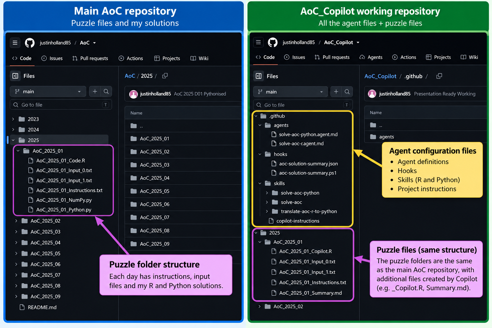

## VS Code + GitHub Copilot

::: {style="display: grid; grid-template-columns: 0.9fr 1.1fr; gap: 24px; align-items: start;"}

::: {}
::: {.build}
> **VS Code is the workspace**
:::

> - Install the **GitHub Copilot extension**
> - Sign in with your GitHub account
> - Copilot appears directly inside VS Code
> - The agent can **read and modify files in the project**
:::

::: {}
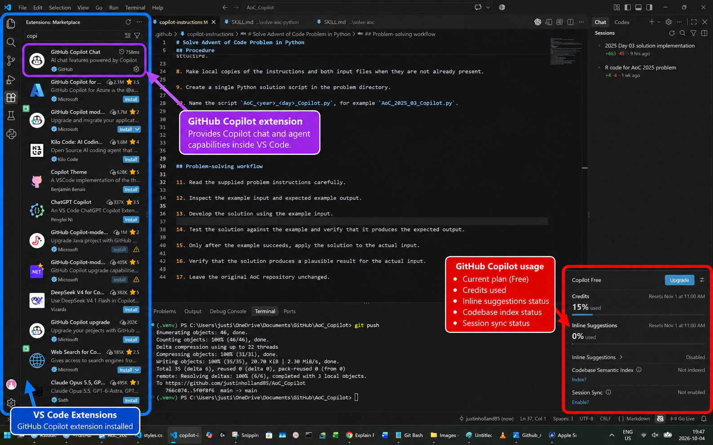
:::

:::


## VS Code + GitHub Copilot


## Instructions

::: {.build}
Instructions are a markdown (.md) document that give the AI project-specific context and constraints.
:::

::: {.build}
They can tell the agent:
:::

> - What the project is
> - What we are trying to achieve
> - How we want the code written
> - What conventions to follow

::: {.build}
They provide persistent guidance that the agent can use when working on the project.
:::

::: {.build}
Think of them as project-specific instructions for the AI.
:::

## Instructions Example

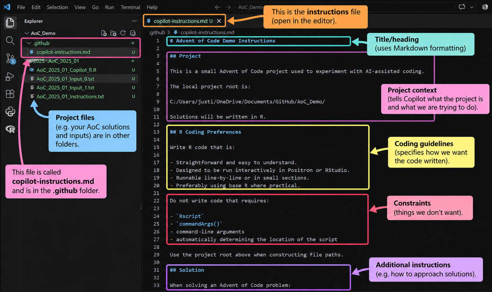

## Setup with instructions

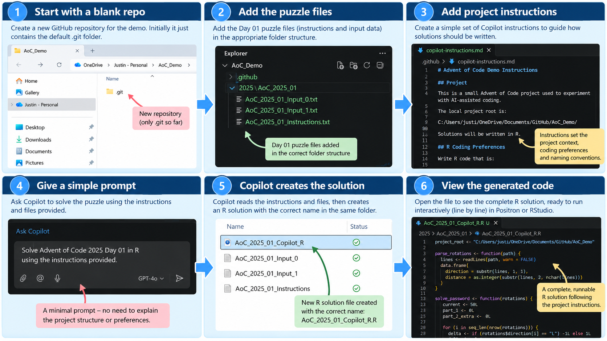

## MCP — Model Context Protocol

::: {.build}
MCP gives the AI access to external tools and information.
:::

::: {.build}
MCP servers are typically provided by third parties and installed separately.
:::


::: {.build}
In this example, MCP lets Copilot:
:::

> - Connect to GitHub
> - Find my Advent of Code repository
> - Read the puzzle instructions and input data
> - Bring that information into the coding workflow

::: {.build}
MCP gives the agent a way to reach beyond its local project.
:::

::: {.build}
**Instructions** → tell the agent how to work  
**MCP** → gives the agent access to things it couldn't access before
:::

## MCP installation in VS Code

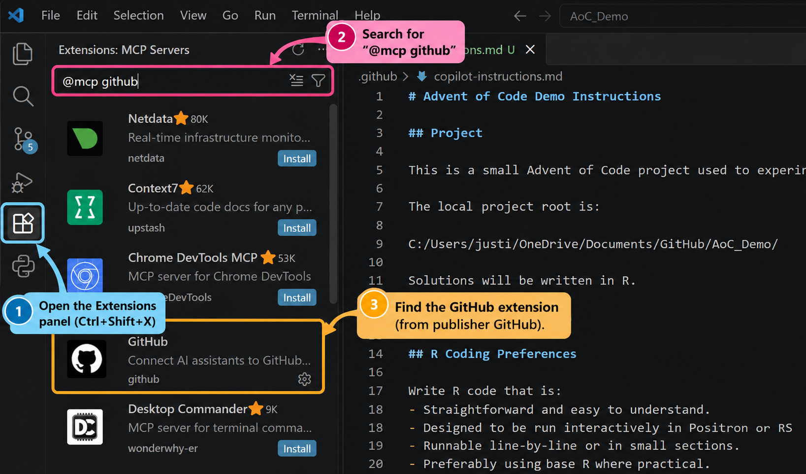

## MCP Demo

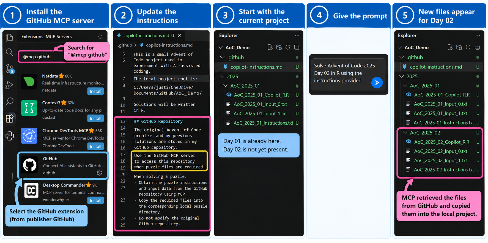

## Skills

::: {.build}
Skills turn instructions into a repeatable procedure.
:::

> - Define a sequence of steps for the agent to follow.
> - Capture a workflow that can be reused across different problems.
> - Keep detailed procedures separate from the general project instructions.

::: {.build}
In this example:
:::

> - An R Skill explains how to retrieve, solve and test an AoC puzzle in R.
> - A Python Skill does the same for Python.

## Skill Example

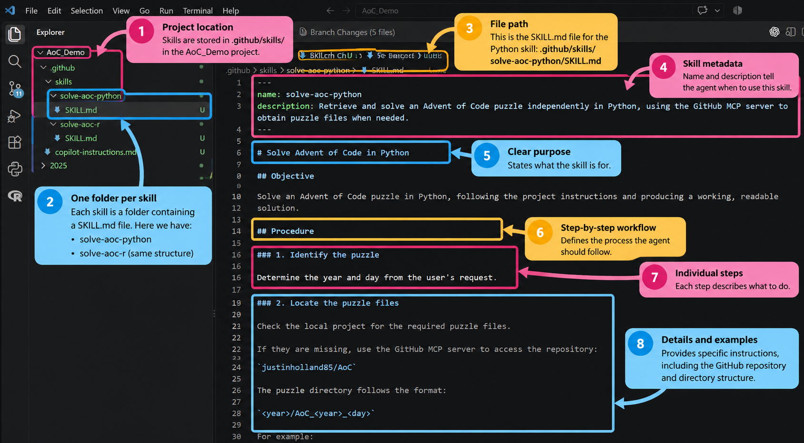

----------

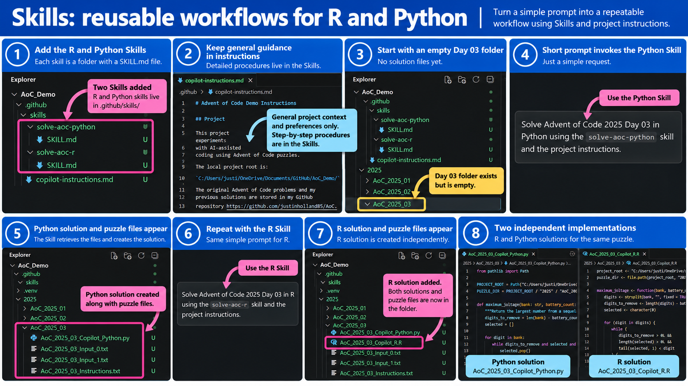


